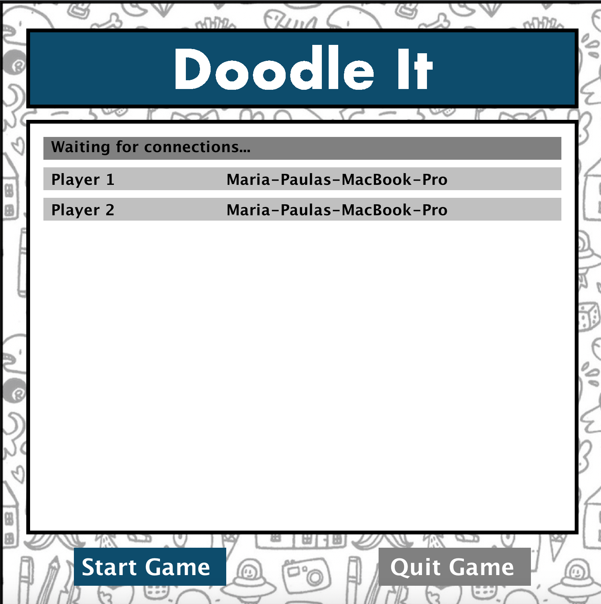
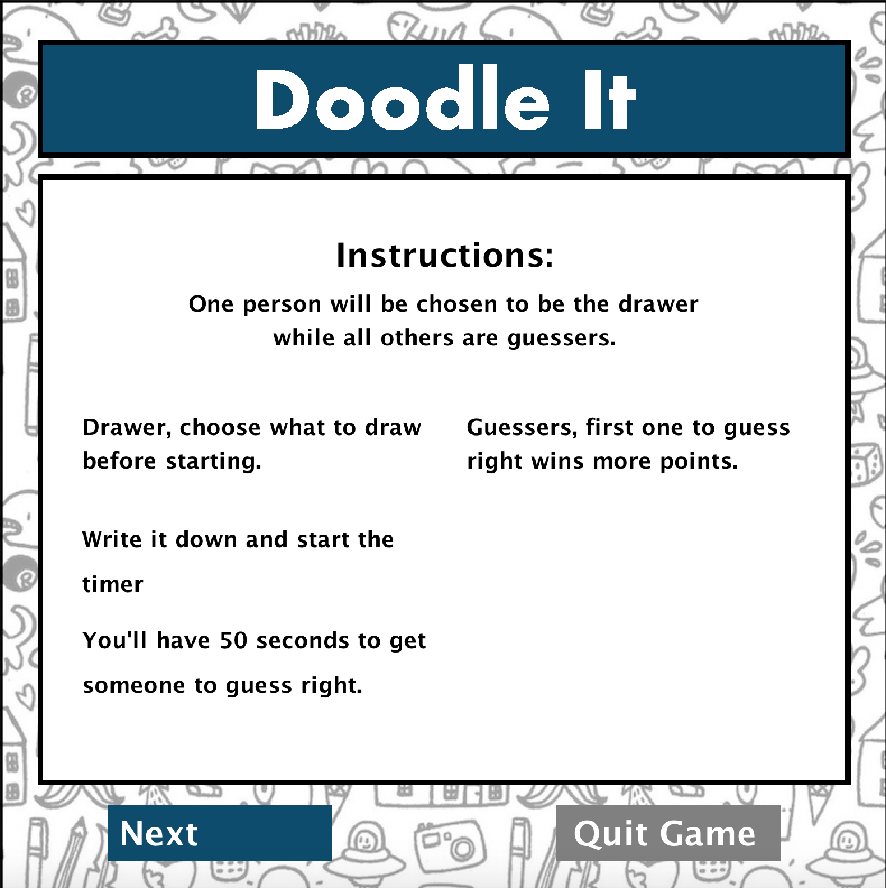

# Sketching through servers
Applies multi-threaded server and client to connect two (or more computers) in order to draw and send these images, sort of like Google Docs for drawings. After much practice, I collaborated with a peer to create a game similar to the app store game called 'Draw something'.

## Language
Java

## How to run
First download all the files to a platform that is able to run Java, for example IntelliJ. To run the normal sketch editor on your own computer, first run the file [SketchServer.java](SketchServer.java) and then, once this is ready, run the file [Editor.java](Editor.java). If you wish to connect with another computer, change line 23 in [Editor.java](Editor.java) and instead of "localhost" to the other computer's IPAddress and then follow the same instructions as before. 

To run the doodle game, first run the file [DoodleGameServer.java](DoodleGameServer.java) and then, once this is ready, run the file [DoodlePLayer.java](DoodlePLayer.java). Follow same instructions as before to connect to another computer. 

## Game Details
The game connects several players and assigns a specific role to each. The 'drawer' is in charge of thinking of a subject and drawing it to the best of their ability while the 'guessers' must compete to see who can figure out what the object is first.
